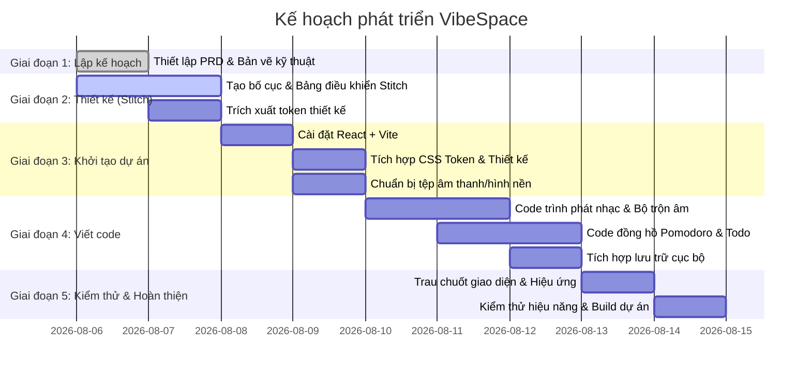

# Kế Hoạch Triển Khai (Implementation Plan) - VibeSpace

Kế hoạch này phác thảo các giai đoạn xây dựng, thiết kế và phát triển ứng dụng VibeSpace theo đúng quy trình làm việc của bạn.

---

## 📋 Tổng Quan Lộ Trình Phát Triển

---

## 🎯 Chi Tiết Công Việc Từng Giai Đoạn (Tasks Split By Phase)

### Giai Đoạn 1: Lập Kế Hoạch (Planning)
- [x] Phỏng vấn làm rõ các yêu cầu cốt lõi (UI/UX, Âm thanh lofi, White noise, Pomodoro, Todo list).
- [x] Viết Tài liệu Đặc tả Yêu cầu Sản phẩm ([`PRD.md`](file:///d:/F8/VIBECODIND/vibe-space-studio/docs/PRD.md)).
- [x] Viết Tài liệu Kiến trúc Kỹ thuật ([`Tech_architecture.md`](file:///d:/F8/VIBECODIND/vibe-space-studio/docs/Tech_architecture.md)).
- [x] Thiết lập Kế hoạch Lộ trình Phát triển tổng quan ([`Plan.md`](file:///d:/F8/VIBECODIND/vibe-space-studio/docs/Plan.md)).
- [x] Đồng bộ hóa kế hoạch và lấy ý kiến phê duyệt từ người dùng.

---

### Giai Đoạn 2: Thiết Kế Giao Diện (Google Stitch Design)
Sử dụng công cụ Google Stitch để thiết kế giao diện kính mờ và các token thiết kế chuẩn.
- [ ] Khởi tạo dự án `vibespace-dashboard` trên Google Stitch.
- [ ] Thiết kế Component hình nền động (Backdrop Layer) hỗ trợ tùy chọn mờ/tối.
- [ ] Thiết kế Layout Grid chính (Header + Grid 3 cột chính: Trái, Giữa, Phải).
- [ ] Thiết kế Component Đồng hồ Pomodoro trung tâm (vòng tròn tiến trình, nút điều khiển, số đếm ngược).
- [ ] Thiết kế Component Todo List (Thẻ kính mờ, danh sách công việc, ô nhập, các nút tích hoàn thành).
- [ ] Thiết kế Component Music Player & White Noise Mixer (Thanh trượt âm lượng, nút phát/tạm dừng, ô nhập liên kết Youtube, danh sách lofi chọn sẵn).
- [ ] Thiết kế Bảng cài đặt thời gian Pomodoro tùy chỉnh và chọn chuông báo.
- [ ] Thiết kế Thanh chọn hình nền nhanh dạng lưới (Background Selector) đặt ở cạnh dưới.
- [ ] Xuất bản hệ thống Token thiết kế (`DESIGN.md`) bao gồm màu sắc, bo góc, độ mờ, font chữ.

---

### Giai Đoạn 3: Thiết Lập Dự Án & Đồng Bộ Thiết Kế (Project Setup)
Chuẩn bị mã nguồn và các tệp âm thanh, hình ảnh, video chạy nền.
- [ ] Khởi tạo dự án React + Vite + TypeScript trong workspace làm việc.
- [ ] Tải xuống thiết kế và các CSS Token từ Google Stitch.
- [ ] Tích hợp các CSS Variables và lớp kính mờ vào `tokens.css` và `glass.css`.
- [ ] Thiết lập cấu trúc các thư mục mã nguồn (`components/`, `hooks/`, `styles/`, `public/audio/`, `public/images/`, `public/videos/`).
- [ ] Sưu tầm và tải các tệp âm thanh tiếng ồn trắng lặp vòng nhẹ (Rain, Fire, Wind, Waves, Cafe, Birds, Keyboard) lưu vào `public/audio/`.
- [ ] Chuẩn bị các tệp ảnh nền tĩnh (.webp) và video vòng lặp (.mp4) đã tối ưu hóa dung lượng lưu vào `public/images/` và `public/videos/`.

---

### Giai Đoạn 4: Viết Code Logic (Coding & Logic)
Viết code logic React điều phối hoạt động và lưu trữ dữ liệu.
- [ ] Xây dựng Custom Hook `useLocalStorage` hỗ trợ lưu tự động trạng thái.
- [ ] Xây dựng Custom Hook `useAudioMix` điều khiển mượt mà danh sách thẻ âm thanh HTML5 và âm lượng độc lập.
- [ ] Xây dựng Custom Hook `usePomodoro` xử lý đếm ngược, chuyển chế độ Focus/Break và cập nhật title tab trình duyệt.
- [ ] Lập trình Component `BackgroundManager` hiển thị ảnh tĩnh/video động và xử lý chỉnh độ mờ (opacity).
- [ ] Lập trình Component `YouTubePlayer` gọi API YouTube IFrame, phát nhạc từ URL dán vào hoặc lọc tìm kiếm danh sách lofi có sẵn.
- [ ] Lập trình Component `SoundMixer` hiển thị giao diện các thanh trượt âm lượng và kết nối với hook `useAudioMix`.
- [ ] Lập trình Component `PomodoroTimer` giao diện vòng tròn đếm ngược, nút điều khiển và phát chuông báo khi hoàn tất.
- [ ] Lập trình Component `TodoList` xử lý thêm/sửa/xóa/hoàn thành công việc, cùng thuật toán tự động reset việc đã hoàn thành khi sang ngày mới.
- [ ] Lắp ráp các component vào `App.tsx` và đồng bộ lưu dữ liệu toàn cục vào LocalStorage.

---

### Giai Đoạn 5: Kiểm Thử, Trau Chuốt & Hoàn Thiện (Verification & Polish)
Kiểm tra hiệu suất tải, tính tương thích thiết bị và tối ưu trải nghiệm.
- [ ] Kiểm thử Responsive (Desktop, Tablet, Mobile) và tối ưu hóa vị trí các panel nổi khi thu gọn.
- [ ] Kiểm tra rò rỉ bộ nhớ hoặc lỗi âm thanh chồng lặp từ trình phát YouTube IFrame và các tệp âm thanh tiếng ồn trắng.
- [ ] Tối ưu hóa hiệu ứng lặp vòng lặp (seamless loop) cho âm thanh và video nền.
- [ ] Kiểm tra cơ chế tự động reset Todo hàng ngày bằng cách thay đổi ngày giả lập trong LocalStorage.
- [ ] Build dự án bằng Vite để kiểm tra lỗi biên dịch TypeScript, CSS hoặc các tệp tĩnh.
- [ ] Tối ưu hóa tốc độ tải trang ban đầu và hiệu năng render các tấm kính mờ (glassmorphism).
