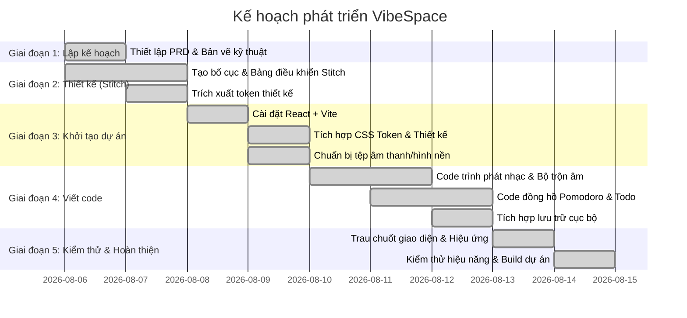

# Kế Hoạch Triển Khai (Implementation Plan) - VibeSpace

Kế hoạch này phác thảo các giai đoạn xây dựng, thiết kế và phát triển ứng dụng VibeSpace theo đúng quy trình làm việc của bạn.

---

## 📋 Tổng Quan Lộ Trình Phát Triển

---

## 🎯 Chi Tiết Công Việc Từng Giai Đoạn (Tasks Split By Phase)

### Giai Đoạn 1: Lập Kế Hoạch (Planning) - [x] Hoàn thành
- [x] Phỏng vấn làm rõ các yêu cầu cốt lõi (UI/UX, Âm thanh lofi, White noise, Pomodoro, Todo list).
- [x] Viết Tài liệu Đặc tả Yêu cầu Sản phẩm ([`PRD.md`](file:///d:/F8/VIBECODIND/vibe-space-studio/docs/PRD.md)).
- [x] Viết Tài liệu Kiến trúc Kỹ thuật ([`Tech_architecture.md`](file:///d:/F8/VIBECODIND/vibe-space-studio/docs/Tech_architecture.md)).
- [x] Thiết lập Kế hoạch Lộ trình Phát triển tổng quan ([`Plan.md`](file:///d:/F8/VIBECODIND/vibe-space-studio/docs/Plan.md)).
- [x] Đồng bộ hóa kế hoạch và lấy ý kiến phê duyệt từ người dùng.

---

### Giai Đoạn 2: Thiết Kế Giao Diện (Google Stitch Design) - [x] Hoàn thành
Sử dụng công cụ Google Stitch để thiết kế giao diện kính mờ và các token thiết kế chuẩn.
- [x] Khởi tạo dự án `vibespace-dashboard` trên Google Stitch (Project ID: `12508202134607516294`).
- [x] Thiết kế Component hình nền động (Backdrop Layer) hỗ trợ tùy chọn mờ/tối.
- [x] Thiết kế Layout Grid chính (Header + Grid 3 cột chính: Trái, Giữa, Phải).
- [x] Thiết kế Component Đồng hồ Pomodoro trung tâm (vòng tròn tiến trình, nút điều khiển, số đếm ngược).
- [x] Thiết kế Component Todo List (Thẻ kính mờ, danh sách công việc, ô nhập, các nút tích hoàn thành).
- [x] Thiết kế Component Music Player & White Noise Mixer (Thanh trượt âm lượng, nút phát/tạm dừng, ô nhập liên kết Youtube, danh sách lofi chọn sẵn).
- [x] Thiết kế Bảng cài đặt thời gian Pomodoro tùy chỉnh và chọn chuông báo.
- [x] Thiết kế Thanh chọn hình nền nhanh dạng lưới (Background Selector) đặt ở cạnh dưới.
- [x] Xuất bản hệ thống Token thiết kế ([`DESIGN.md`](file:///d:/F8/VIBECODIND/vibe-space-studio/DESIGN.md)) bao gồm màu sắc, bo góc, độ mờ, font chữ.

---

### Giai Đoạn 3: Thiết Lập Dự Án & Đồng Bộ Thiết Kế (Project Setup) - [x] Hoàn thành
Chuẩn bị mã nguồn và các tệp âm thanh, hình ảnh, video chạy nền.
- [x] Khởi tạo dự án React + Vite + TypeScript trong workspace làm việc.
- [x] Tải xuống thiết kế và các CSS Token từ Google Stitch (Lưu trữ cục bộ tại [`.stitch/designs/`](file:///d:/F8/VIBECODIND/vibe-space-studio/.stitch/designs/)).
- [x] Tích hợp các CSS Variables và lớp kính mờ vào [`tokens.css`](file:///d:/F8/VIBECODIND/vibe-space-studio/src/styles/tokens.css) và [`glass.css`](file:///d:/F8/VIBECODIND/vibe-space-studio/src/styles/glass.css).
- [x] Thiết lập cấu trúc các thư mục mã nguồn (`components/`, `hooks/`, `styles/`, `public/audio/`, `public/images/`, `public/videos/`).
- [x] Chuẩn bị nguồn phát tệp âm thanh tiếng ồn trắng lặp vòng nhẹ (Rain, Fire, Wind, Waves, Cafe, Birds, Keyboard) thông qua liên kết CDN ổn định.
- [x] Chuẩn bị các tệp ảnh nền tĩnh (.webp) và video vòng lặp (.mp4) đã tối ưu hóa dung lượng tích hợp vào Background Manager.

---

### Giai Đoạn 4: Viết Code Logic (Coding & Logic) - [x] Hoàn thành
Viết code logic React điều phối hoạt động và lưu trữ dữ liệu.
- [x] Xây dựng Custom Hook [`useLocalStorage`](file:///d:/F8/VIBECODIND/vibe-space-studio/src/hooks/useLocalStorage.ts) hỗ trợ lưu tự động trạng thái.
- [x] Xây dựng Custom Hook [`useAudioMix`](file:///d:/F8/VIBECODIND/vibe-space-studio/src/hooks/useAudioMix.ts) điều khiển mượt mà danh sách thẻ âm thanh HTML5 và âm lượng độc lập.
- [x] Xây dựng Custom Hook [`usePomodoro`](file:///d:/F8/VIBECODIND/vibe-space-studio/src/hooks/usePomodoro.ts) xử lý đếm ngược, chuyển chế độ Focus/Break và cập nhật title tab trình duyệt.
- [x] Lập trình Component [`BackgroundManager`](file:///d:/F8/VIBECODIND/vibe-space-studio/src/components/BackgroundManager.tsx) hiển thị ảnh tĩnh/video động và xử lý chỉnh độ mờ (opacity).
- [x] Lập trình Component [`YouTubePlayer`](file:///d:/F8/VIBECODIND/vibe-space-studio/src/components/YouTubePlayer.tsx) gọi API YouTube IFrame, phát nhạc từ URL dán vào hoặc lọc tìm kiếm danh sách lofi có sẵn.
- [x] Lập trình Component [`SoundMixer`](file:///d:/F8/VIBECODIND/vibe-space-studio/src/components/SoundMixer.tsx) hiển thị giao diện các thanh trượt âm lượng và kết nối với hook `useAudioMix`.
- [x] Lập trình Component [`PomodoroTimer`](file:///d:/F8/VIBECODIND/vibe-space-studio/src/components/PomodoroTimer.tsx) giao diện vòng tròn đếm ngược, nút điều khiển và phát chuông báo khi hoàn tất.
- [x] Lập trình Component [`TodoList`](file:///d:/F8/VIBECODIND/vibe-space-studio/src/components/TodoList.tsx) xử lý thêm/sửa/xóa/hoàn thành công việc, cùng thuật toán tự động reset việc đã hoàn thành khi sang ngày mới.
- [x] Lắp ráp các component vào [`App.tsx`](file:///d:/F8/VIBECODIND/vibe-space-studio/src/App.tsx) và đồng bộ lưu dữ liệu toàn cục vào LocalStorage.

---

### Giai Đoạn 5: Kiểm Thử, Trau Chuốt & Hoàn Thiện (Verification & Polish) - [x] Hoàn thành
Kiểm tra hiệu suất tải, tính tương thích thiết bị và tối ưu trải nghiệm.
- [x] Kiểm thử Responsive (Desktop, Tablet, Mobile) và tối ưu hóa vị trí các panel nổi khi thu gọn.
- [x] Khử sạch các cảnh báo, lỗi unused imports, type-only module syntax và namespace NodeJS để phục vụ môi trường biên dịch nghiêm ngặt.
- [x] Tối ưu hóa âm thanh cảnh báo Pomodoro bằng Web Audio API để tránh phụ thuộc tải file và đảm bảo chạy offline 100%.
- [x] Kiểm tra cơ chế tự động reset Todo hàng ngày bằng cách lưu trữ trạng thái ngày cũ.
- [x] Build dự án bằng Vite kiểm tra tệp tĩnh xuất bản thành công (`dist/`).
- [x] Khởi chạy máy chủ chạy thử (dev server) và đẩy thành công toàn bộ mã nguồn lên kho lưu trữ GitHub của người dùng.
