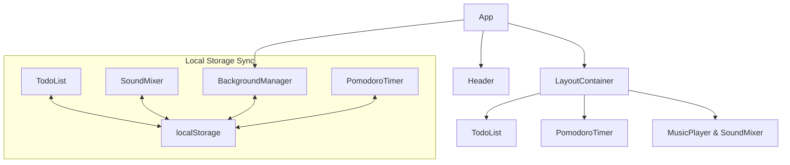

# Kiến Trúc Kỹ Thuật (Technical Architecture) - VibeSpace

## 1. Công Nghệ Sử Dụng (Technology Stack)
- **Framework chính**: React 18+ (kết hợp TypeScript) khởi tạo bằng Vite.
- **Định dạng giao diện (Styling)**: Vanilla CSS (Sử dụng CSS Variables, Flexbox, Grid, CSS Modules hoặc tệp stylesheet toàn cục) để tạo hiệu ứng kính mờ (glassmorphism) tùy chỉnh mà không cần cài đặt các thư viện cồng kềnh.
- **Hệ thống âm thanh (Audio Engine)**:
  - **YouTube Lofi**: Tích hợp trực tiếp thông qua [YouTube IFrame Player API](https://developers.google.com/youtube/iframe_api_reference).
  - **White Noise Mixer (Tiếng ồn trắng)**: Sử dụng các thẻ `<audio>` mặc định của HTML5, điều khiển âm lượng thông qua thuộc tính volume và kích hoạt chế độ lặp lại tự động (`loop={true}`).
- **Công cụ build**: Vite (đảm bảo việc khởi động máy chủ chạy thử cực nhanh và xuất bản bản build tối ưu bằng Rollup).
- **Lưu trữ dữ liệu**: Lưu trữ cục bộ phía client bằng `localStorage` (không yêu cầu cơ sở dữ liệu hoặc máy chủ backend).

---

## 2. Cấu Trúc Thư Mục & Tệp Tin (Directory Structure)
Cấu trúc mã nguồn React được tổ chức mô-đun, tương thích trực tiếp với các tệp thiết kế được tải xuống từ Google Stitch:

```text
vibe-space-studio/
├── public/                  # Các tài nguyên tĩnh
│   ├── audio/               # Các tệp âm thanh tiếng ồn trắng (rain.mp3, fire.mp3, v.v.)
│   ├── videos/              # Video vòng lặp nhẹ nền (.mp4)
│   └── images/              # Hình nền tĩnh độ phân giải cao (.webp)
├── src/
│   ├── assets/              # Hình ảnh logo, icon dạng SVG dùng trong ứng dụng
│   ├── components/          # Các thành phần giao diện tái sử dụng
│   │   ├── BackgroundManager.tsx
│   │   ├── PomodoroTimer.tsx
│   │   ├── YouTubePlayer.tsx
│   │   ├── SoundMixer.tsx
│   │   └── TodoList.tsx
│   ├── hooks/               # Các custom hooks xử lý trạng thái và chức năng
│   │   ├── useLocalStorage.ts
│   │   ├── useAudioMix.ts
│   │   └── usePomodoro.ts
│   ├── styles/              # Định nghĩa thiết kế và giao diện (CSS)
│   │   ├── tokens.css       # Các biến thiết kế (màu sắc, độ mờ, đường viền)
│   │   ├── glass.css        # Các lớp tiện ích hiệu ứng kính mờ (glassmorphic classes)
│   │   └── index.css        # Khởi tạo CSS, định dạng font, cấu hình layout chính
│   ├── App.tsx              # Component cha lắp ghép toàn bộ ứng dụng
│   ├── main.tsx             # Điểm khởi chạy React DOM
│   └── vite-env.d.ts
├── docs/                    # Tài liệu yêu cầu sản phẩm và kỹ thuật
│   ├── PRD.md
│   ├── Tech_architecture.md
│   └── Plan.md
├── index.html
├── vite.config.ts
├── package.json
└── tsconfig.json
```

---

## 3. Kiến Trúc Luồng Hoạt Động & Bố Cục (Component Flow)

### 3.1 Bố Cục Grid Màn Hình (Layout Grid)
Giao diện ứng dụng được chia thành các phân khu rõ ràng để đảm bảo khả năng hiển thị tốt trên các loại màn hình khác nhau:
- **Lớp hình nền (`BackgroundManager`)**: Nằm dưới cùng của trang web; hiển thị hình nền ảnh tĩnh hoặc video, hỗ trợ thanh kéo chỉnh độ mờ (opacity).
- **Thanh tiêu đề (Header)**: Hiển thị logo/tên ứng dụng "VibeSpace", các nút ẩn/hiện nhanh các bảng điều khiển bên và biểu tượng cài đặt.
- **Trục trung tâm (`PomodoroTimer`)**: Trọng tâm của trang web, hiển thị đồng hồ đếm ngược cùng hiệu ứng vòng tiến trình.
- **Cột bên trái (`TodoList`)**: Thẻ chứa danh sách công việc hàng ngày, có thể thu gọn lại khi cần tập trung tuyệt đối.
- **Cột bên phải (`Music & Ambient Controls`)**: Thẻ chứa trình phát nhạc YouTube và bộ trộn thanh trượt White Noise. Có thể thu gọn.



---

## 4. Giải Pháp Kỹ Thuật Chi Tiết

### 4.1 Tích Hợp Trình Phát YouTube (YouTube Player API)
- **Cơ chế**: Video YouTube được nhúng ẩn thông qua iframe (hoặc thu nhỏ trong một khung điều khiển) sử dụng YouTube Player IFrame API.
- **Tải Script**: React sẽ nạp thư viện API của YouTube động khi ứng dụng khởi tạo:
  ```typescript
  // Nạp script YouTube API một cách năng động
  const tag = document.createElement('script');
  tag.src = "https://www.youtube.com/iframe_api";
  document.body.appendChild(tag);
  ```
- **Điều khiển âm lượng**: Sử dụng hàm `player.setVolume(value)` với giá trị từ 0 đến 100.
- **Xử lý tìm kiếm và liên kết**:
  - Dán link trực tiếp: Trích xuất ID video bằng biểu thức chính quy (regex) `/(?:youtube\.com\/(?:[^\/]+\/.+\/|(?:v|e(?:mbed)?)\/|.*[?&]v=)|youtu\.be\/)([^"&?\/\s]{11})/`.
  - Tìm kiếm: Thực hiện bộ lọc tìm kiếm tại client dựa trên danh sách các kênh phát nhạc lofi được định nghĩa sẵn trong tệp cấu hình JSON tĩnh.

### 4.2 Cơ Chế Phát Âm Thanh Tiếng Ồn Trắng (White Noise Engine)
- **Tạo luồng âm thanh**: Khởi tạo danh sách các thẻ `<audio>` HTML5 trong custom hook `useAudioMix`.
- **Vòng lặp âm thanh**: Nhằm hạn chế việc âm thanh bị khựng khi lặp lại, thuộc tính `loop` mặc định của HTML5 được tối ưu hóa cùng cơ chế đồng bộ âm lượng tức thì theo vị trí các thanh trượt.
- **Định nghĩa kiểu dữ liệu kênh âm thanh**:
  ```typescript
  interface AmbientSound {
    id: string;
    name: string;
    fileUrl: string;
    volume: number; // phạm vi từ 0.0 đến 1.0
    isPlaying: boolean;
  }
  ```

### 4.3 Quản Lý Trạng Thái Đồng Hồ Pomodoro
- **Trạng thái (States)**: `IDLE` (chưa bắt đầu), `RUNNING` (đang đếm ngược), `PAUSED` (tạm dừng), `FINISHED` (hoàn thành).
- **Chế độ hẹn giờ (Interval Modes)**: `FOCUS` (làm việc), `SHORT_BREAK` (nghỉ ngắn), `LONG_BREAK` (nghỉ dài).
- **Đồng bộ với Thẻ trình duyệt (Tab Title)**:
  - Cập nhật liên tục `document.title` theo giây: `${phút}:${giây} | VibeSpace`.
- **Âm thanh kết thúc**: Sử dụng HTML5 Audio để kích hoạt âm chuông (chime) nhẹ khi thời gian đếm ngược kết thúc.

### 4.4 Thuật Toán Reset Danh Sách Công Việc Tự Động Hàng Ngày
Mỗi khi người dùng truy cập hoặc làm mới trang web, hàm kiểm tra ngày mới sẽ được chạy tự động:
```typescript
function checkAndResetTasks() {
  const lastVisit = localStorage.getItem('vibespace_last_visit');
  const today = new Date().toDateString(); // Ví dụ: "Thu Aug 06 2026"
  
  if (lastVisit && lastVisit !== today) {
    // Phát hiện ngày mới!
    const savedTodos = JSON.parse(localStorage.getItem('vibespace_todos') || '[]');
    
    // Tự động xóa công việc đã hoàn thành, chỉ giữ lại các công việc chưa xong
    const carriedTodos = savedTodos.filter((todo: any) => !todo.completed);
    
    localStorage.setItem('vibespace_todos', JSON.stringify(carriedTodos));
  }
  
  localStorage.setItem('vibespace_last_visit', today);
}
```

---

## 5. Tích Hợp Hệ Thống Thiết Kế (Google Stitch)
Vì quy trình yêu cầu thiết kế giao diện trước trên Google Stitch, hệ thống giao diện trong code sẽ sử dụng các thuộc tính CSS Custom Properties tương ứng trực tiếp với các Token của Stitch:

```css
/* src/styles/tokens.css */
:root {
  /* Bảng màu - Phong cách Cyberpunk / Lofi Dark Fusion */
  --bg-base: #0f0c1b;
  --bg-panel: rgba(15, 12, 27, 0.45);
  --border-color: rgba(255, 255, 255, 0.08);
  --border-glow: rgba(124, 77, 255, 0.2);
  
  --text-primary: #ffffff;
  --text-secondary: #a3a1b8;
  --accent-color: #8c52ff;
  --accent-glow: 0 0 12px rgba(140, 82, 255, 0.5);
  
  /* Các thuộc tính kính mờ & Đổ bóng */
  --blur-frosted: blur(16px);
  --panel-radius: 16px;
  --shadow-premium: 0 8px 32px 0 rgba(0, 0, 0, 0.37);
  
  /* Chuyển động (Transitions) */
  --transition-smooth: all 0.3s cubic-bezier(0.4, 0, 0.2, 1);
}
```

- Khi tải thiết kế từ Google Stitch về máy, các file CSS sinh ra từ token của thiết kế sẽ khớp hoàn toàn với các biến CSS này, giúp đồng bộ hóa giao diện giữa bản thiết kế và code thực tế một cách tự động.
